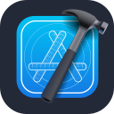

# Hi, I'm Florian! 

## I'm a passionate developer from Germany

→ ⚡ I'm currently studying computer science [@HWR](https://www.hwr-berlin.de/)!  
→ 🚀 I have worked on a new Flutter App called [Daty](https://github.com/Floxyi/Daty)!  
→ 🎶 I have worked on a Spotify menu bar integration for macOS [Jukebox](https://github.com/Floxyi/Jukebox)!  
→ ⛏ I have also been into Minecraft plugin development! ([DevTools](https://github.com/Floxyi/DevTools/), [ChallengePlugin](https://github.com/Floxyi/ChallengePlugin))  
→ 👨‍👦 I'm looking to collaborate with other Developers!  

## Languages and Tools

  

   
